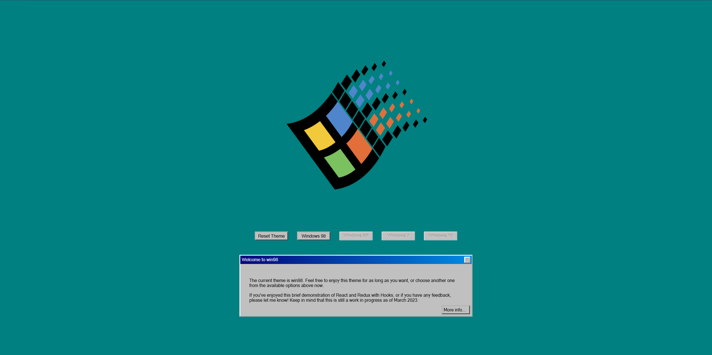

# React Windows Themes
This is a fun CRA (Create-React-App) showcasing past Windows OSes and their themes. It's still a work in progress and is mostly for fun (as well as brushing up on React, Redux, and hooks knowledge).

## Setup
Clone the repo and run `npm start` to get the app up and running. That's it!

## Usage
Each button will transform the styles to match the OS selected. E.g. choosing Windows 98 will make everything look like Windows 98. Etc.